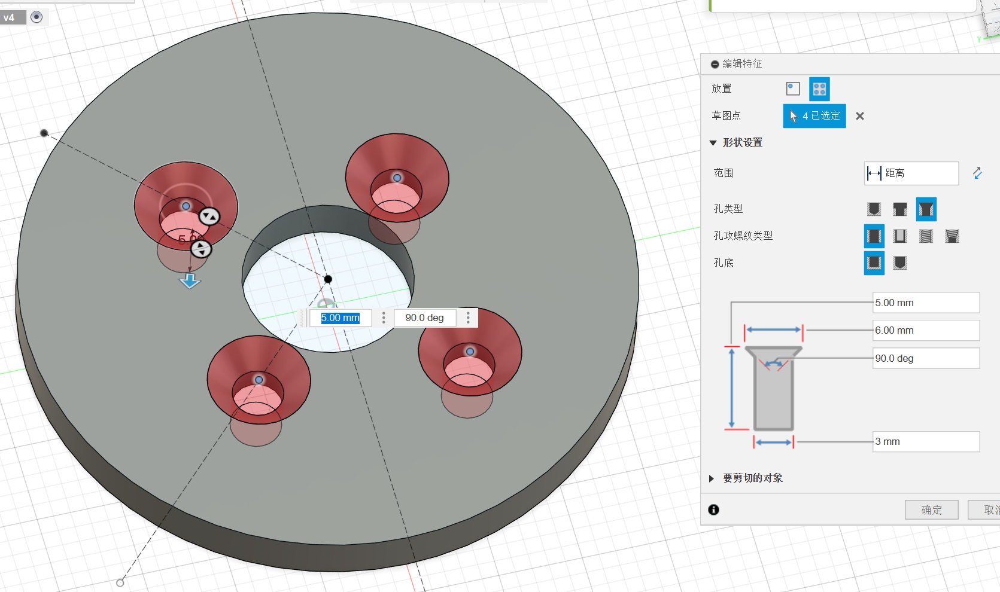
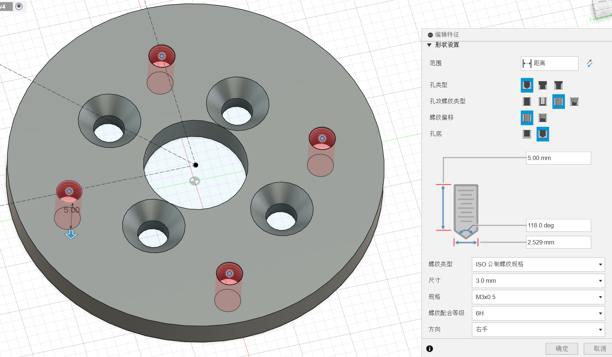

# 生产文件说明

## 小车底板图纸

兼容了几种常见的激光雷达孔位，同时兼容`meles`、`licheepi 4a`还有MATX主板的孔位

图纸包含上下两部分，其中下层板有前后两部分组成，可编辑文件可以用Fusion360打开（会很卡）

- [麦轮小车底盘上板-可编辑](麦轮小车底盘上板-可编辑.f3d) 
- [麦轮小车底盘上板-生产文件](麦轮小车底盘上板.dxf) 
- [麦轮小车底盘下板-可编辑](麦轮小车底盘下板-可编辑.f3d) 
- [麦轮小车底盘下板-生产文件(包含两个件)](麦轮小车底盘下板(两个件).dxf)

零件有一些已知的问题：急停开关距离开发板的位置过近，激光雷达孔位太靠前导致安装后会凸出去

## 无刷电机X减速器连接固定片

无刷电机使用的是[N2830 1300kv 后出轴3.17mm轴径](https://item.taobao.com/item.htm?_u=l2nf4lkkc6e8&id=776568563843)，匹配的[36mm行星齿轮减速器](https://detail.tmall.com/item.htm?_u=l2nf4lkk9e62&id=620401236914)减速比选择的是27：1。

使用的是3mm厚不锈钢加工，需要攻丝+倒角

靠近外面的四个孔是对称的，需要攻M3螺纹。靠近内侧的四个孔两两对称，需要倒角但是不用攻丝。

- [电机固定片-可编辑](电机固定片-可编辑.f3d)
- [电机固定片-生产文件](电机固定片.dxf)

## 降压模块安装座

降压模块我使用的是[这款](https://item.taobao.com/item.htm?_u=l2nf4lkk0252&id=831235040211)，也可以使用其他品牌的降压模块。主要需要注意的是输入电压范围最好是50V以上或者标明6S锂电池可用，防止锂电池尖峰电压击穿导致后级短路。

- [降压模块安装座-可编辑](降压模块安装座-可编辑.f3d)
- [降压模块安装座-step](降压模块安装座.step)
- [降压模块安装座-stl](降压模块安装座.stl)

## 镭神N10P激光雷达固定座

这个就是一个增高垫，可以给N10或者N10P使用，需要配合使用M2和M3的热熔螺母，或者直接用胶带也可以

- [镭神N10P激光雷达固定座-可编辑](镭神N10P激光雷达固定座-可编辑.f3d)
- [镭神N10P激光雷达固定座-step](镭神N10P激光雷达固定座.step)
- [镭神N10P激光雷达固定座-stl](镭神N10P激光雷达固定座.stl)